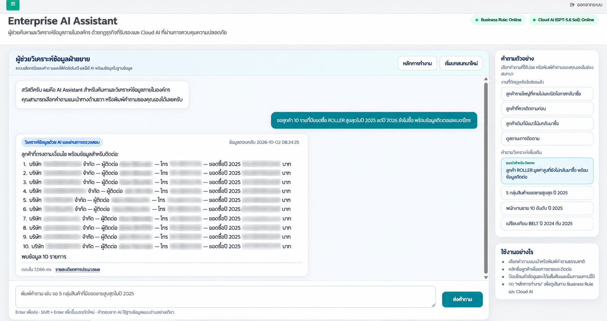
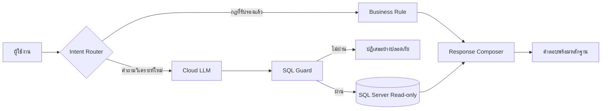

# Enterprise AI Assistant

Portfolio case study ของระบบผู้ช่วยค้นหาและวิเคราะห์ข้อมูลภายในองค์กร โดยออกแบบให้ใช้ **Business Rule ที่ผ่านการรับรอง** สำหรับคำถามที่ทำซ้ำ และใช้ **Cloud LLM** สำหรับคำถามวิเคราะห์ใหม่ภายใต้ SQL Guard และบัญชีฐานข้อมูลแบบ read-only

> Repository นี้แสดงแนวคิด สถาปัตยกรรม และตัวอย่างหน้าจอที่ปิดข้อมูลแล้วเท่านั้น Source code, SQL, schema, credentials และข้อมูลธุรกิจจริงเก็บอยู่ใน private repositories

## Business problem

ฝ่ายขายต้องเปิดหลายหน้าจอใน ERP เพื่อค้นประวัติลูกค้า ยอดซื้อ ผู้ติดต่อ และสินค้าที่เคยซื้อ การวิเคราะห์ลูกค้าเก่าหรือโอกาสขายจึงใช้เวลาและขึ้นอยู่กับประสบการณ์ของผู้ใช้งานแต่ละคน

ระบบนี้รวมข้อมูลที่จำเป็นไว้ในบทสนทนาเดียว ผู้ใช้ถามด้วยภาษาธรรมชาติและได้รับคำตอบที่อ้างอิงข้อมูล พร้อมแสดงเส้นทางการประมวลผลเพื่อให้ตรวจสอบได้

## Solution highlights

- **Hybrid routing** — ใช้กฎธุรกิจที่รับรองแล้วก่อน และใช้ LLM เมื่อเป็นคำถามวิเคราะห์ใหม่
- **Grounded answers** — สร้างคำตอบจากผล query ที่ผ่านการตรวจ ไม่ให้โมเดลเดาตัวเลขเอง
- **SQL safety** — อนุญาตเฉพาะคำสั่งอ่านข้อมูล ตรวจ table/column allowlist และจำกัดจำนวนผลลัพธ์
- **Read-only execution** — backend ใช้ SQL login ที่มีสิทธิ์อ่านเท่าที่จำเป็น
- **Natural responses** — แปลงผลข้อมูลเป็นภาษาที่ฝ่ายขายอ่านและนำไปใช้ต่อได้
- **Evaluation workflow** — เปรียบเทียบ Local/Cloud model แยก technical success ออกจาก business correctness
- **Rule promotion** — SQL ที่ผู้ตรวจรับรองสามารถนำไปพัฒนาเป็น Business Rule เพื่อลด latency และค่าใช้จ่าย Cloud
- **Operational visibility** — มี telemetry, monitoring, failover lab และประวัติการประเมินโดยไม่เก็บ secret

## High-level flow

อ่านรายละเอียดที่ [Architecture](docs/architecture.md) และ [Hybrid Agent Flow](docs/hybrid-agent-flow.md)

## Example use cases

- ลูกค้ารายใหญ่รายใดยังไม่กลับมาซื้อและควรให้ฝ่ายขายเริ่มติดตาม
- ลูกค้ารายใดมีมูลค่าสูงและมีโอกาสกลับมาซื้อ
- สินค้ากลุ่มใดที่ลูกค้าเคยซื้อ แต่ยังไม่ซื้อในปีปัจจุบัน
- เปรียบเทียบยอดขายของกลุ่มสินค้าระหว่างสองปี
- จัดอันดับยอดขายตามกลุ่มสินค้า ลูกค้า หรือพนักงานขาย
- ขอผู้ติดต่อและเบอร์โทรของลูกค้าที่ตรงตามเงื่อนไข

ตัวอย่าง request/response ที่ใช้ข้อมูลสมมติอยู่ใน [examples](examples/mock-conversations.json)

## Safety by design

ระบบแยกหน้าที่ของ LLM, SQL Guard และ SQL executor ออกจากกัน โมเดลเสนอ SQL ได้ แต่ไม่มีสิทธิ์ execute โดยตรง SQL ต้องผ่านกฎความปลอดภัยและ semantic checks ก่อนส่งให้ executor ที่ใช้บัญชี read-only

รายละเอียดอยู่ที่ [Security Design](docs/security-design.md)

## Evaluation approach

การประเมินแยกเป็นสองชั้น:

1. **Technical validation** — pipeline สำเร็จ, SQL Guard ผ่าน, query อ่านข้อมูลได้, latency และ token usage
2. **Business review** — ปี เงื่อนไข การจัดอันดับ การรวมยอด และความหมายของคำตอบตรงกับโจทย์ธุรกิจ

อ่านกระบวนการที่ [Evaluation & Rule Candidate](docs/evaluation-results.md)

## Technology

- PHP และ JavaScript สำหรับหน้าจอที่เชื่อมกับ ERP เดิม
- Python และ FastAPI สำหรับ AI/backend services
- SQL Server และ ODBC สำหรับ data access แบบ read-only
- Local LLM และ OpenAI model สำหรับ model evaluation
- Deterministic Business Rules สำหรับคำถามที่รับรองแล้ว
- Git/GitHub สำหรับ version control และแยก private source ออกจาก public portfolio

## Repository scope

Repository นี้ไม่มี source code production, database dump, data dictionary, prompt ภายใน, SQL จริง, API key, password หรือข้อมูลลูกค้า ภาพหน้าจอใช้ข้อมูลที่ปิดบังเพื่อการสาธิตเท่านั้น

## English summary

Enterprise AI Assistant is a governed hybrid analytics assistant integrated with an existing ERP workflow. It prioritizes approved deterministic business rules and routes new analytical questions through a cloud LLM, SQL safety gates, and a read-only execution layer. This public repository contains only a sanitized case study; proprietary implementation and business data remain private.

## Copyright

Copyright © 2026 Nutnoiz. All Rights Reserved. See [NOTICE](NOTICE.md).
