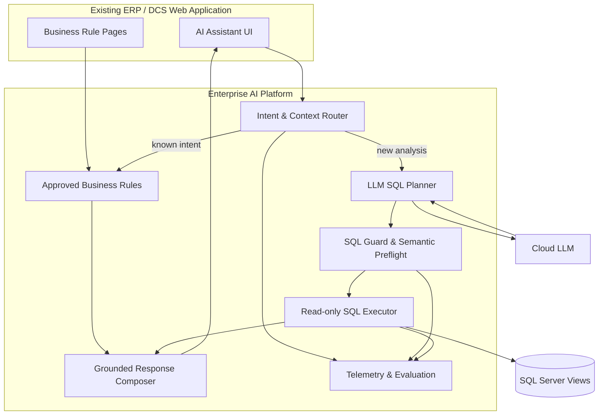

# Architecture

## Components

## Design decisions

### Keep the existing ERP interface

ระบบเพิ่ม AI Assistant เข้าใน web application เดิมเพื่อให้ผู้ใช้งานเข้าสู่ระบบ สิทธิ์ และเมนูตามกระบวนการที่คุ้นเคย ไม่บังคับให้เปลี่ยนเครื่องมือใหม่ทั้งหมด

### Separate deterministic and generative paths

คำถามที่มีนิยามธุรกิจชัดเจนใช้ Business Rule เพื่อให้ผลทำซ้ำได้ ส่วนคำถามใหม่ใช้ LLM เป็น SQL planner ภายใต้ขอบเขตที่กำหนด

### Do not give the model database credentials

LLM ไม่เชื่อมต่อฐานข้อมูลโดยตรง โมเดลได้รับเฉพาะ schema contract ที่จำเป็นและส่งคืนข้อเสนอ SQL ให้ guard ตรวจ

### Compose answers from returned rows

ตัวเลขและรายการในคำตอบสร้างจากผล query หลัง execute ไม่ใช้ข้อความที่โมเดลจำหรือคาดเดา

## Deployment boundary

- DCS web application เรียก FastAPI ผ่าน endpoint ภายใน
- FastAPI อ่าน secrets จากไฟล์ภายนอก repository และ environment variables
- SQL Server เปิดให้บัญชี application แบบ read-only เข้าถึงเฉพาะ objects ที่กำหนด
- Private repositories แยกจาก public portfolio repository นี้
