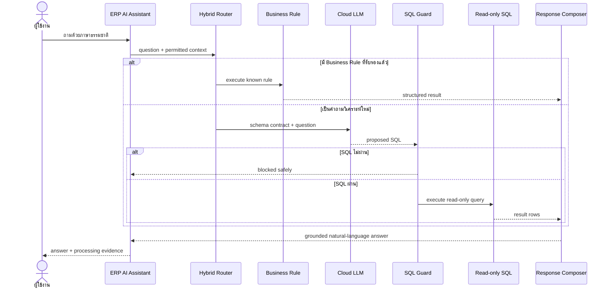
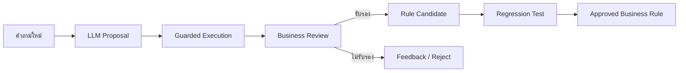

# Hybrid Agent Flow

## Decision flow

## Why hybrid

| Requirement | Business Rule | LLM path |
|---|---|---|
| ผลทำซ้ำได้ | สูง | ต้องควบคุมด้วย guard และ evaluation |
| รองรับคำถามใหม่ | จำกัด | สูง |
| Latency | ต่ำ | สูงกว่า |
| Cloud cost | ไม่มี | มีตามการใช้งาน |
| อธิบาย SQL | กำหนดไว้ล่วงหน้า | ตรวจจาก proposal และ execution evidence |

Hybrid routing จึงใช้ Business Rule เป็นเส้นทางแรก และใช้ LLM เมื่อต้องการความยืดหยุ่นเพิ่มเติม

## Rule promotion lifecycle

แนวทางนี้ทำให้ผลการใช้งานจริงกลายเป็นข้อมูลสำหรับปรับปรุงระบบ โดยไม่เปลี่ยน SQL ที่โมเดลเสนอให้เป็น production rule โดยอัตโนมัติ
